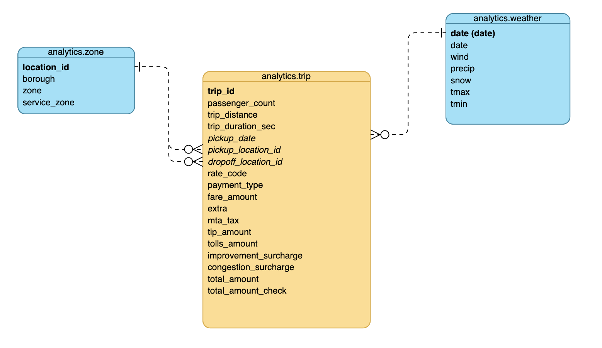

# Udacity Data Engineering Nanodegree - Capstone Project

## Introduction

In the final project of the course my goal is to stich together most of the technologies I learned about in the different modules of the DEND into a coherent data pipeline.

For the basis of the project I chose the famous __NYC taxi trips__ dataset. This is a well known and widely used data source in data analysis and data science projects. Even if it's not a very novel dataset, from a data engineering perspective it is a great candidate for this project for several reasons:

- It is an extremely large dataset, using big data tools is essential
- Updated regularily, great for scheduled pipelines
- Can be merged with several other datasets, eg. geography, weather, etc.

## Goal of the Project

For the project I assumed that all trips included in the source data belong to a single taxi company. The goal of the project is to setup a data warehouse on AWS that can provide the management of this imaginative taxi company with high level view and the possibility to drill down and gain deeper insights about the performance of the company.

## Data Model

The final data model is a (small) star schema where the fact table contains trips with the detailed fare amounts, while dimension tables contain start and end location and daily weather information.



Distribution Styles:

- Trips: `pickup_date` is the distribution key and sort key (this will require periodic repartitioning as new data comes in)
- Weather: `date` is the distribution key and sort key (this will require periodic repartitioning as new data comes in)
- Zones: this is a small table, distribution style is `ALL`

Based on this schema I also built an OLAP cube with geography, time and weather categories as dimensions.

## Datasets

### 1. NYC Taxi & Limousine Commission (TLC) Trip Record Data

Source: [https://www1.nyc.gov/site/tlc/about/tlc-trip-record-data.page](https://www1.nyc.gov/site/tlc/about/tlc-trip-record-data.page)

This is the base "transactional" dataset, containing millions of individual taxi trips. The individual files are availabile in a public S3 bucket.

### 2. NYC TLC Taxi Zone Lookup Table

Source: [https://s3.amazonaws.com/nyc-tlc/misc/taxi+_zone_lookup.csv](https://s3.amazonaws.com/nyc-tlc/misc/taxi+_zone_lookup.csv)

This is supplementary data for identifying the zones where the individual trips started or ended. Ideal for adding a geographical dimension to the analysis.

### 3. NOAA Daily Weather Data

Source: [https://www.ncdc.noaa.gov/cdo-web/datasets#GHCND](https://www.ncdc.noaa.gov/cdo-web/datasets#GHCND)

This is a separate data source which adds weather information to the trip data. I requested the file for this project via website of NOAA.

## Technologies/Services Used

- **Storage:** AWS S3
- **Workflow management:** Airflow
- **Data Warehouse:** Amazon Redshift
- **Supplementary tools:** PyData ecosystem (eg. Jupyter, pandas, etc.)

## Processing Steps

I manage all data operations in an Airflow pipeline, from launching a Redshift cluster to creating the final data outputs. Only exception is weather data preprocessing, which I did in a separate Python script.

\<PIPELINE IMAGE\>

### 1. Preprocessing

The original csv file from NOAA contained daily observations from 134 weather stations in New York, New Jersey and Connecticut, from 2017-01-01 to 2020-07-31.

In order to simulate loading from different formats and to preprocess the datafile, I filtered the columns, split up the csv file into daily JSON files, and uploaded them to the S3 bucket in the following format: `s3://dend-capstone-somi/weather/<YEAR-MONTH>/weather-<DATE>.json` (this is done in `preprocess_weather_data.py`).

### 2. Setting up Redshift

For the sake of practicing these technologies, I created tasks in my Airflow pipeline to set up a Redshift cluster and save connection details into Airflow for later use. This way I can restart my project from scratch just by running the pipeline (if the Redshift cluster is already up and running the related tasks succeed quickly).

### 3. ETL

#### 3.1 Staging

- Data from the input sources is staged in Redshift tables under `stage` schema:
  - `staging.trip`: data from the yellow cab trips data source for the current date range
  - `staging.zone`: taxi zone identification data
  - `staging.weather`: daily weather data for the current date range for all weather stations
- Tables are (re)created each time the pipeline is run, making sure that no residual data from previous runs spills into the current operation.
- Staging tasks are set up in a way, that they create meaningful results in scheduler DAG runs and ad-hoc (manual) runs:
  - If DAG is scheduled, import date range is between previous successful run date and current execution date
  - If DAG is run manually or there is no previous success date the import is run between the preset minimum date and current execution date

#### 3.2 Loading to Analytics Tables

- Final tables live under the `analytics` schema
- Insertion is done via `PostgresOperators` with SQL statements in separate files
- Insert tasks only rely on data in staging tables, therefore work in batch or incremental (scheduled) DAG runs
- `analytics.zone` (dimension):
  - primary key is `location_id` which maps to `pickup_location_id` and `dropoff_location_id` on the fact table
  - it is truncated and reloaded with each import (this is a very small table)
- `analytics.weather` (dimnension):
  - primary key is the `date`, which maps to `pickup_date` on the fact table
  - updated incrementally, new data is inserted and existing rows are updated with the incoming values
- `analytics.trip` (the fact table)
  - primary key is a hash value constructed from pickup/dropoff timestamps and location id and passenger count (this is a makeshift solution as the data source does not contain unique identifiers)
  - also updated incrementally, with new rows inserted and any existing rows completely updated with the incoming data

## How to Run the Project

## Files in the Repository

```bash
.
├── README.md
└── data
```

## Potential Improvements

1. **Redshift Setup:** In a real project creating Redshift cluster straight from Airflow wouldn't really make sense, but here this presented a great opportunity to practice Airflow and AWS infrastructure as code in the same exercise.
2. **Data cleaning:** Even though I did some preprocessing and quality checks on the data, I could do more on cleaning and validating the input data. In a real life project this would be crucial. Here my focus was to set up the infrastructure and pipelines, accepting some implied assumptions about the data quality.
3. **Security:** When setting up the infrastructure I mostly used default values and settings. In a real life project it would be crucial to ensure the security of the setup via proper configuration of VPCs, security groups, roles and user access management.
4. **Custom operators:** Custom operators for staging the data look very similar at first sight, even though they differ in some key elements (query structure, S3 key construction, etc.). In a  larger setup it might be worth merging their functionality into a single staging operator and handle the logical differences inside this merged operator. For this project I considered as premature optimization.
5. **Deploying pipelines:** I ran Airflow on my laptop which is obviously not a viable solution in a real setup. Properly deploying Airflow in the cloud with the appropriate resources and architecture and making sure that pipelines can run smoothly could be a project in itself.

## What If's

### What if the data was increased by 100x

### What if the pipelines would be run on a daily basis by 7 am every day

### What if the database needed to be accessed by 100+ people
