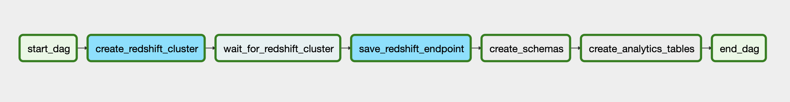

# Udacity Data Engineering Nanodegree - Capstone Project

## Introduction

In the final project of the course my goal is to stich together most of the technologies I learned about in the different modules of the Data Engineering Nanodegree into a coherent data pipeline. The resulting data structure is not extremely complex in itself, instead I tried to focus on creating a realistic ETL workflow using Airflow. In hindsight this needed almost as much work as figuring out the actual data structure.

For the basis of the project I chose the famous __NYC taxi trips__ dataset. This is a well known and widely used data source in data analysis and data science projects. Even if it's not a very novel dataset, from a data engineering perspective it is a great candidate for this project for several reasons:

- It is an extremely large dataset, using big data tools is essential
- Updated regularily (albeit with some latency), great for scheduled pipelines
- Can be merged with several other datasets, eg. geography, weather, etc.

## Goal of the Project

For the project I assumed that all trips included in the source data belong to a single taxi company. The goal of the project is to setup a data warehouse on AWS that can provide the management of this imaginative taxi company with high level view and the possibility to drill down and gain deeper insights about the performance of the company.

## Datasets

### 1. NYC Taxi & Limousine Commission (TLC) Trip Record Data

Source: [https://www1.nyc.gov/site/tlc/about/tlc-trip-record-data.page](https://www1.nyc.gov/site/tlc/about/tlc-trip-record-data.page)

This is the base "transactional" dataset, containing millions of individual taxi trips. The individual files are availabile in a public S3 bucket.

### 2. NYC TLC Taxi Zone Lookup Table

Source: [https://s3.amazonaws.com/nyc-tlc/misc/taxi+_zone_lookup.csv](https://s3.amazonaws.com/nyc-tlc/misc/taxi+_zone_lookup.csv)

This is supplementary data for identifying the zones where the individual trips started or ended. Ideal for adding a geographical dimension to the analysis.

### 3. NOAA Daily Weather Data

Source: [https://www.ncdc.noaa.gov/cdo-web/datasets#GHCND](https://www.ncdc.noaa.gov/cdo-web/datasets#GHCND)

This is a separate data source which adds weather information to the trip data. I requested the file for this project via website of NOAA.

## Technologies/Services Used

- **Storage:** AWS S3
  - As the main data already resides in S3 it made sense to put the other raw data files in S+
- **Workflow management:** Airflow
  - DAGs are perfect for reasoning about ETL processes
  - I also wanted to create a solution where bulk loads and (simulated) incremental updates can run
- **Data Warehouse:** Amazon Redshift
  - Star schema (and derived OLAP cubes) assume relational data modelling
  - Redshift provides distributed, columnar storage, which is great boost for large amount of data
- **Supplementary tools:** PyData ecosystem (eg. Jupyter, pandas, etc.)

## Data Model

The final data model is a (small) star schema where the fact table contains trips with the detailed fare amounts, while dimension tables contain start and end locations and daily weather information.


This schema is great for **aggregating trip counts, revenues and passenger counts** by **geographic**, **date**, and **weather** dimensions in ad-hoc queries or perodically updated OLAP cubes. I left out columns from the original data sources to streamline the data and focus on these dimensions and use cases.

### Size of Resulting Tables

**Note:** Throughout the project I used _Yellow Taxi Trip Records_ subset of the NYC-TLC data, starting from 2020-01-01 until the last available datapoint at the time of writing this (2020-06-30). The ETL pipeline would work for the larger dataset (including green taxis and/or For-Hire Vehicle data) and wider timewindow (assuming there were no breaking changes in data structure).

With these filtering criteria the ETL pipeline results in these table sizes:

```bash

dev=# select count(*) from analytics.trip;
  count
----------
 23021983

dev=# select count(*) from analytics.weather;
 count
-------
   213


dev=# select count(*) from analytics.zone;
 count
-------
   265
```

### Dictionary of final tables

#### analytics.trip

- **trip_id:** unique identifier created by hashing multiple columns
- **passenger_count:** number of passengers in trip (can be missing)
- **trip_distance:** traveled distance in miles as reported by the taximeter
- **trip_duration_sec:** trip time in seconds
- **pickup_date:** date when trip started
- **pickup_location_id:** taxi zone where trip started
- **dropoff_location_id:** taxi zone where trip ended
- **rate_code:** final rate code in effect at the end of the trip
- **payment_type:** type of payment
- **fare_amount, extra, mta_tax, tip_amount, tolls_amount,  improvement_surcharge, congestion_surcharge:** components ot total amount
- **total_amount:** total amount charged to passengers
- **total_amount_check:** TRUE if total amount components add up to `total_amount`, FALSE if not

#### analytics.weather

- **date:** date of weather metrics measured at NYC Central Park weather station
- **wind:** average daily wind speed (meters per second)
- **precip:** daily precipitation in milimeters
- **snow:** daily snowfall in milimeters
- **tmax/tmin:** daily min/max temperature

#### analytics.zone

- **location_id:** id of taxizone
- **borough:** borough of NYC
- **zone:** taxi zone - smallest unit of this table
- **service_zone:** larger unit of zone structure

## Processing Steps

I manage all operations in two Airflow pipelines, from launching a Redshift cluster to creating the final data outputs. Only exception is weather data preprocessing, which I did in a separate Python script.

### 1. Preprocessing

The original csv file from NOAA contained daily observations from 134 weather stations in New York, New Jersey and Connecticut, from 2017-01-01 to 2020-07-31.

In order to simulate loading from different formats and to preprocess the datafile, I filtered the columns, split up the csv file into daily JSON files, and uploaded them to the S3 bucket in the following format: `s3://dend-capstone-somi/weather/<YEAR-MONTH>/weather-<DATE>.json` (this is done in `preprocess_weather_data.py`).

### 2. Setting up Redshift

For the sake of practicing these technologies, I created tasks in an Airflow pipeline to set up a Redshift cluster and save connection details into Airflow for later use. This way I can restart my project from scratch just by updating the config file (if necessary) and running the pipeline (if the Redshift cluster is already up and running the related tasks succeed quickly).



### 3. ETL

- I created a separate DAG for staging, transforming and loading the data when the Redshift cluster is ready.
- The pipeline in its current form can be run on the first day of each month, which suits the monthly nature of the trip data files.


#### 3.1 Staging

- Data from the input sources is staged in Redshift tables under `stage` schema:
- Tables are freshly created for each DAG execution date in the form of `staging.tablename_YYYY-MM-DD` using Airflow templating, making sure that data from separate DAG runs don't spill into each other.

#### 3.2 Data Cleaning and Data Quality Checks

- Weather dataset is filtered for the selected weather station (NYC Central Park) right after data is inserted into staging table.
- Cleaning taxi trip dataset is filtered for multiple criteria:
  - Zero distance trips are removed from staging tables right after data is imported from S3, because these are usually either duplicates or seem to be some sort of technical entries.
  - Trips with `NULL` as vendorID are also removed from staging (these are considered erroneous entries for this projcet, further research might validate them)
  - Invalid trips are filtered out when inserting data to final tables. Trips are considered invalid if there is another record with the same pickup and dropoff times and locations, but with negative dollar amounts (these are most likely trips that were charged back or canceled for some reason).
- Zone data is inserted as is, but updated for every run, assuming NYC TLC maintains zone definitions.
- Data Quality is checked by two criteria, checked for all three data tables after staging finished:
  - Unwanted `NULL` values for given columns, as set in the custom `CheckNullValuesOperator`
  - Uniqueness of rows by either the primary key (`analytics.zone` and `analytics.weather`) or a combination of columns (`analytics.trip`), as set in the custom `CheckUniqueValuesOperator`

#### 3.3 Loading to Analytics Tables

- Final tables live under the `analytics` schema
- Insertion is done via `PostgresOperators` with SQL statements in separate files
- Insert tasks only rely on data in staging tables, therefore work in batch or incremental (scheduled) DAG runs
- `analytics.zone` (dimension):
  - primary key is `location_id` which maps to `pickup_location_id` and `dropoff_location_id` on the fact table
  - it is truncated and reloaded with each import (this is a very small table)
  - this is a small table, therefore distribution style is `ALL`
- `analytics.weather` (dimnension):
  - primary key is the `date`, which maps to `pickup_date` on the fact table
  - updated incrementally, new data is inserted and existing rows are updated with the incoming values
  - `date` is the distribution key and sort key (this will require periodic repartitioning as new data comes in)
- `analytics.trip` (the fact table)
  - primary key is a hash value constructed from pickup/dropoff timestamps and location id and passenger count (this is a makeshift solution as the data source does not contain unique identifiers)
  - also updated incrementally, with new rows inserted and any existing rows completely updated with the incoming data
  `pickup_date` is the distribution key and sort key (this will require periodic repartitioning as new data comes in)

## How to Run the Project

1. The project can be run in Airflow by reading DAGs, plugins and configuration from `./airflow` and `./config`.

## Files in the Repository

```bash
.
├── README.md
├── airflow
│   ├── dags
│   │   ├── create_redshift_dag.py
│   │   ├── etl_dag.py
│   │   └── sql
│   │       ├── create_analytics_tables.sql
│   │       ├── create_stage_tables.sql
│   │       ├── insert_trip_data.sql
│   │       └── insert_weather_data.sql
│   └── plugins
│       ├── __init__.py
│       └── operators
│           ├── __init__.py
│           ├── check_null_operator.py
│           ├── check_unique_operator.py
│           ├── create_redshift_operator.py
│           ├── save_redshift_endpoint.py
│           ├── stage_trip_data.py
│           ├── stage_weather_data.py
│           └── stage_zone.py
├── config
│   └── redshift.cfg
├── preprocess_weather_data.py
└── requirements.txt
```

## Potential Improvements

1. **Redshift Setup:** In a real project creating Redshift cluster straight from Airflow wouldn't really make sense, but here this presented a great opportunity to practice Airflow and AWS infrastructure as code in the same exercise.
2. **Security:** When setting up the infrastructure I mostly used default values and settings. In a real life project it would be crucial to ensure the security of the setup via proper configuration of VPCs, security groups, roles and users (both on AWS and on Redshift database/schema level).
3. **Data cleaning:** Even though I did some preprocessing and quality checks on the data, I could do more on cleaning and validating the input data. In a real life project this would be crucial. Here my focus was to set up the infrastructure and pipelines, accepting some implied assumptions about the data quality.
4. **Custom operators:** Custom operators for staging the data look very similar at first sight, even though they differ in some key elements (query structure, S3 key construction, etc.). In a  larger setup it might be worth merging their functionality into a single staging operator and handle the logical differences inside this merged operator. I considered this as premature optimization for this project.
5. **Deploying pipelines:** I ran Airflow on my laptop which is obviously not a viable solution in a real setup. Properly deploying Airflow in the cloud with the appropriate resources and architecture and making sure that pipelines can run smoothly could be a project in itself.
6. **OLAP Cube:** The final data lends itself nicely for creating multidimensional OLAP cubes, eg. summing up the total fare amount by date periods (weeks or months), pickup and dropoff locations and probably even weather conditions by categorizing numeric weather variables.
7. **Utilizing Spark:** If were to process the whole NYC TLC dataset including yellow and green taxis and other trips for the whole available date range, we would need substantial resources. This operation would only be feasible if we used a Spark cluster to read data from S3 and crunch it.

## What If's

### What if the data was increased by 100x

The ETL pipeline should run fine with 100x amount of data, and based on the usage stats probably the current Redshift cluster would also be able to hold this much data. The execution would be much slower, but as long as the processing remains monthly, this shouldn't be showstopper.

For even larger factors we would need:

- bigger storage on Redshift cluster with more nodes to more efficiently handle the load
- a larger Airflow setup with more workers for parallel task execution
- if the monthly files would get extraordinarily large, we would probably need Spark to crunch the numbers (and maybe write results back to S3 instead of holding them in Redshift)

### What if the pipelines would be run on a daily basis by 7 am every day

Current setup runs monthly, due to the fact that NYC TLC trip data is accessible in montly format (and with a considerable lag in time). Nevertheless the pipeline could run on a daily basis with only small modifications, but this would be quite inefficient as the staging tasks would have to read monthly files during every run and just keep records for a single day. The rest of the pipeline should function the same as currently (zone data is fairly constant, weather data is already in daily format).

If that the trip data was in daily files, the switching from monthly to daily run would literally mean changing a few lines of code (eg. DAG `schedule_interval` and the way manifest files are constructed from `execution_date` in staging tasks).

### What if the database needed to be accessed by 100+ people

In this case giving access to a "bare" Redshift datawarehouse for all the users wouldn't be enough from neither security, operations nor user experience standpoint. For serving 100+ users I would setup either a curated dashboard (Plotly Dash, Redash or similar) with the results of relevant queries (this needs maintenance) or install a "self-service" BI tool (eg. Tableau, Power BI) in front of the datawarehouse, and let users query data via these channels instead of poking around in the datawarehouse.
